# Cluster Builder - Advanced Swarm Deployment

This a step-by-step guide to configuring a VMware ESX based Docker CE/EE Swarm infrastructure in support of the cluster-builder advanced deployment model.

1. [Overview](#overview)
2. [Configure VMware VLANs](#configure-vmware-vlans)
3. [Configure DNS](#configure-dns)
4. [Install pfSense Swarm Gateway VM](#install-pfsense-swarm-gateway-vm)
5. [Setup pfSense LAN Interfaces and DHCP](#setup-pfsense-lan-interfaces-and-dhcp)
6. [Deploy Cluster Builder Control Station VM](#deploy-cluster-builder-control-station-vm)
7. [Setup Cluster Package Definition Repository](#setup-cluster-package-definition-repository)
8. [Advanced Cluster Configuration Package](#advanced-cluster-configuration-package)
9. [Configure Remote API for Load Balancing](#configure-remote-api-for-load-balancing)
10. [Setup Remote API & Traefik Passthrough Load Balancers](#setup-remote-api-&11raefik-passthrough-load-balancers)
12. [Setup pfSense WAN Firewll Rules](#setup-pfsense-wan-firewall-rules)
13. [Setup HAProxy SSL Offloaded Services](#setup-haproxy-ssl-offloaded-services)
14. [Setup NFS Server VM](#setup-nfs-server-vm)
15. [Deploy Cluster](#deploy-cluster)
16. [Troubleshooting](#troubleshooting)

## Overview

The following diagram illustrates the advanced swarm deployment configuration:

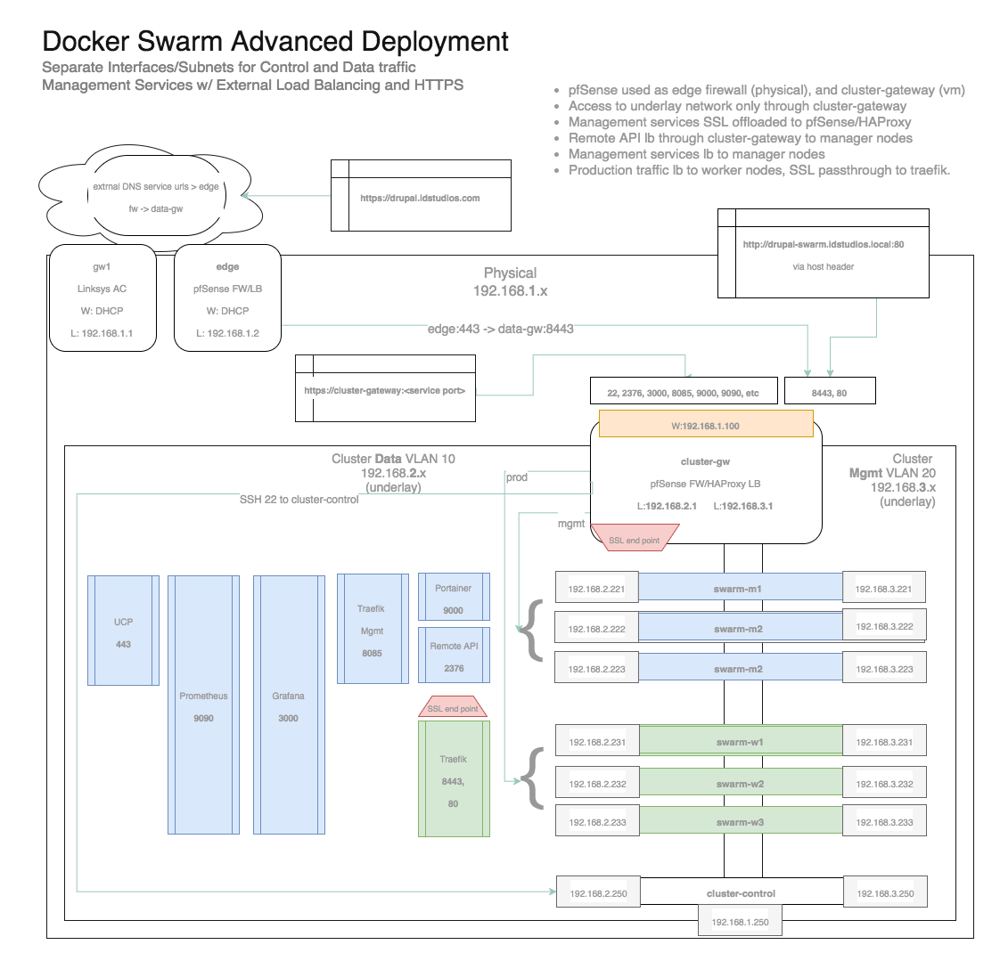

With this configuration, the __cluster-control__ vm is connected to the private VLANs used by the swarm virtual machine nodes.  Direct access to the underlying vm nodes is not permitted from the external physical network.  All management is done through the __cluster-control__ station.

The private VLANs are implemented in the VMware ESX environment.

Access to the management services is secured and load balanced by the dedciated __cluster-gateway__, which provides firewall and load balancing services.  In this example [pfSense Community Edition](https://www.pfsense.org/) is used as the __cluster-gateway__, and it is installed as a virtual machine.

Control and Data plane traffic in the Docker Swarm has been separated each assigned a dedicated interface (subnet), with all inbound traffic directed to the data plane interfaces.

## Configure VMware VLANs

The creation of the dedicated private VLANs for the Control and Data interfaces of the swarm is relatively straightforward on VMware ESX.  

> __Note__ that for VLANs to span multiple ESX hosts requires they be connected via a __managed switch__.  Standard unmanaged switches will not work.

For each ESX host, in __Networking > Port Groups__:

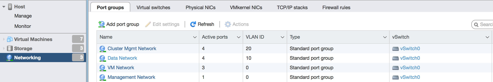

Create two new port groups (VLANs) for the Control and Data plane interfaces of the swarm:

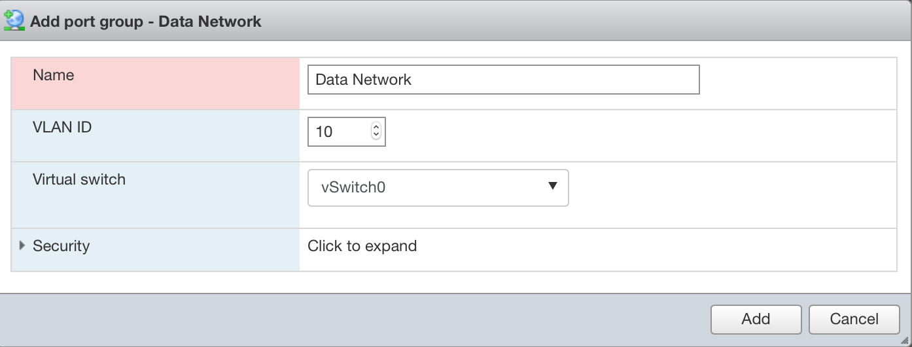

If there are multiple ESX hosts, the __managed switch__ needs to be configured to tag the outgoing packets with the designated VLAN ID.  This passes encapsulated VLAN packets between the switch ports.

The following screenshot shows the VLAN port assignment (taken from a Netgear GS108T 8-port managed switch):

> __Note__ that each port shows "T", indicating the VLAN traffic is passed between ports.

## Configure DNS

It is necessary that all of the required DNS entries be setup and configured before deployment.  This includes:

* All Swarm VM node hostnames
* External DNS names for management services
* External DNS names for deployed services

It is useful to configure your cluster __hosts__ file to establish the various DNS entries required.

Examples, based on the internal example domain of __idstudios.local__:

    cluster-gateway.idstudios.local -> physical gateway address
    remote-api.idstudios.local -> physical gateway address
    swarm-m[1-3] -> private VLAN data plane addresses
    swarm-w[1-6] -> private VLAN data plan addresses

## Install pfSense Swarm Gateway VM

[pfSense Community Edition](https://www.pfsense.org/) is a free to use firewall appliance with numerous advanced capabilities, such as:

* Professional Grade Firewall
* Integrated General Purpose Load Balancer
* Integrated HAProxy
* Inegrated BIND

We use __pfSense__ as the __cluster-gateway__ which controls and manages access to the swarm residing in the private VLAN.

Download the __pfSense__ ISO, and upload it to a shared datastore available to the ESX servers.

Create a new VM with this ISO, and make sure of the following:

* VM has at least 1GB of RAM
* VM has three nics:
  * Nic on the physical bridged VM Network (accessible by the physical network) - this is for the WAN side of the firewall
  * Nic on the Data plane VLAN - this is for the LAN_DATA side
  * Nic on the Mgmt/Control plan VLAN w/ DHCP Service - this is for the LAN_MGMT side

The pfSense configuration will be based on the network configuration of our deployed swarm.

There are a few initial general configuration settings required:

1. In __System > Advanced Setup__ set the pfSense __cluster-gateway__ webConfigurator to use HTTPS, and __port 4444__. 

2. In the same location, make sure __Disable webConfigurator redirect rule__ is enabled.  This way the __cluster-gateway__ can receive 80 and 443 for production traffic (though any ports can be used, these simply align with the example)

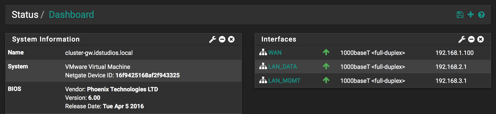

## Setup pfSense LAN Interfaces and DHCP

As installation occurs on the Control/Mgmt plane interface but traffic is routed on the Data plane interface, the __cluster-gateway__ should have a LAN interface for each of the subnets.

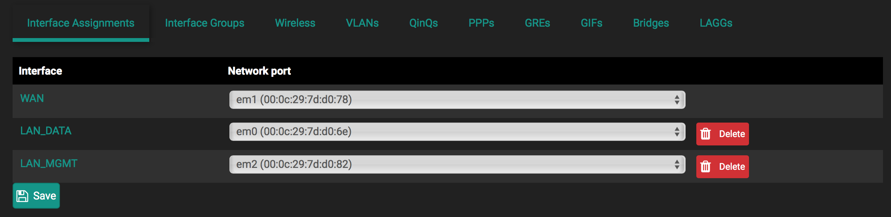

And for the Control/Mgmt plane enable DHCP in support of the deployment process:

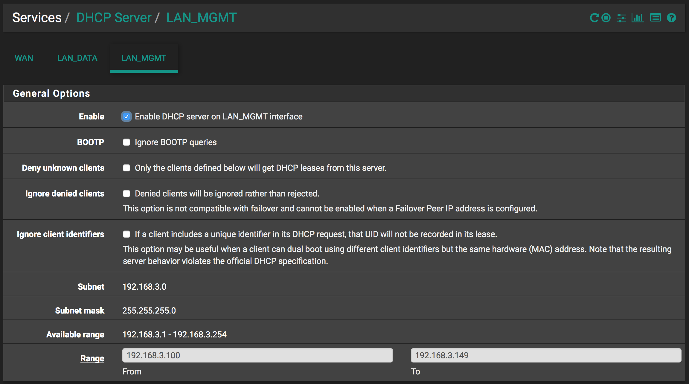

> DHCP can be enabled only for the deployment process, and then disabled.

## Deploy Cluster Builder Control Station VM

Follow the deployment guidelines for the __cluster-control__ workstation VM (as per the [project](https://github.com/ids/cluster-builder-control) readme instructions).

It is important that the __cluster-control__ vm have at least 3 nics.

> The default build of __cluster-builder-control__ has only a single nic, but additional virtual nics can be added and configured manually post deployment).

As shown in the overview diagram, the __cluster-control__ station must reside on all three subnets.

Once the __cluster-control__ VM has been deployed, it can be accessed directly through VMware:

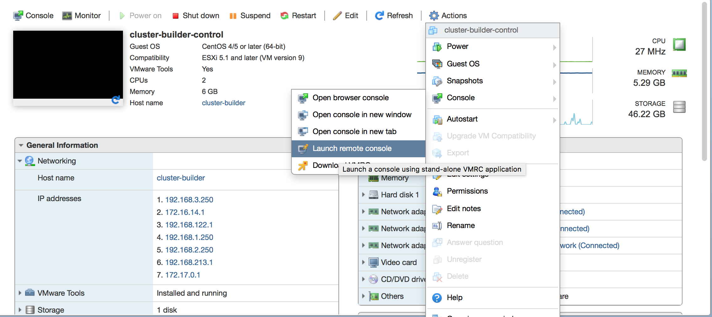

And provides a full Gnome 3.x desktop environment:
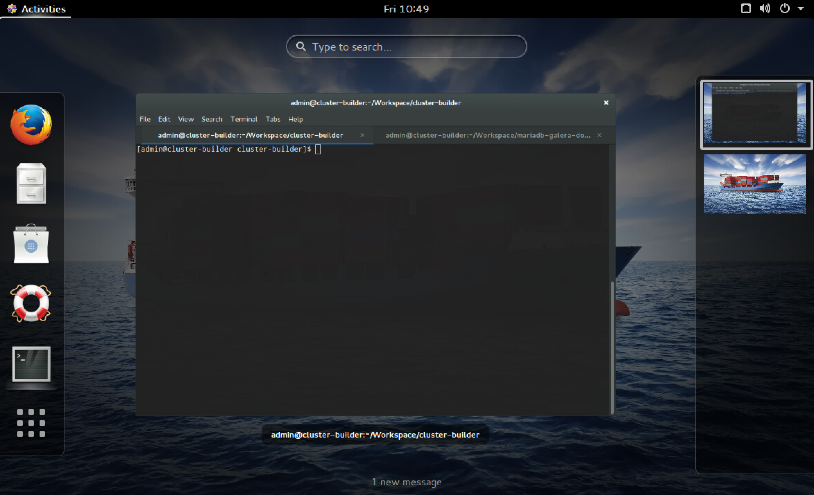

The __cluster-control__ vm will be used to deploy the swarms into the private VLAN environment.

## Setup Cluster Package Definition Repository

Create the user/organization specific top level cluster repo folder under __clusters__.  This should be as short as possible as it will be referenced often as a CLI parameter.

Eg.

For my company __Intelligent Design Studios__ I created the __ids__ folder for all of our cluster deployment packages:

    clusters
      |_ids

This is initialized as a private git repository, which is stored in a secure on-prem gitlab instance.  Within the __ids__ folder, the cluster packages are kept (as per those in examples).

    clusters
      |_ids
        |_swarm-dev

After a deployment the resulting certificates for secured TLS remote api access are then stored within this managed, versioned private git repo.

After successful deployment:

    cd clusters/ids
    git push origin master

Which keeps the cluster definition packages and resulting certificates safe and secure.

At any point the entire structure of the toolset can be restored with two simple git clone commands:

    git clone git@github.com:ids/cluster-builder.git
    cd cluster-builder/clusters
    git clone git@myprivategitlab.com:ids/ops/ids-clusters.git ids

Updates and enhancements made to the __cluster-builder__ toolkit are abstracted from the user specific cluster definition packages.

## Advanced Cluster Configuration Package

See the example package [esxi-centos-swarm-advanced](../examples/esxi-centos-swarm-advanced/hosts) __hosts__ file for the example configuration for the layout illustrated in the overview.

## Configure Remote API for Load Balancing

In the __Advanced Swarm Deployment__ configuration, all access to the Remote API is load balanced over the 3-manager-nodes (HA).

This requires __docker_swarm_mgmt_cn__ to be set in the __hosts__ file.

Eg.

    docker_swarm_mgmt_cn=remote-api.idstudios.local

The server name specified should be the DNS entry that maps to the __cluster-gateway__ WAN interface address.

This value is then used when creating the self signed TLS certificates shared by all of the manager nodes.  It is used for the CN value, and must match the address used for client access.

### Docker CE

pfSense example configuration:

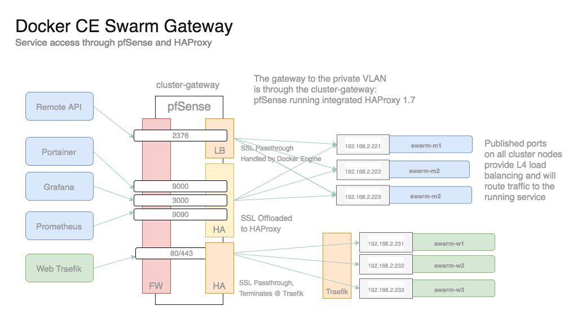

### Docker EE

pfSense example configuration:

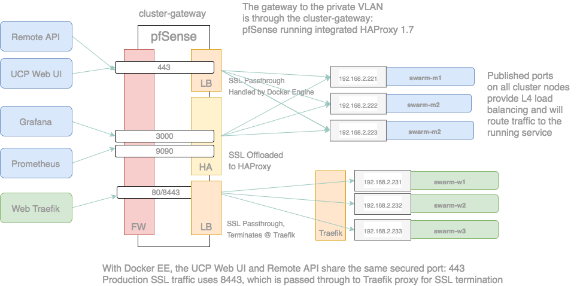

> __Note__ that in Docker EE the UCP handles both Web UI and Remote API over the same port 443.  With Docker CE there is no built in Web UI, and in place of this we use Portainer on port 9000 (with SSL offloading) and Remote API over 2376 (with SSL handled by the managers).

## Setup Remote API & Traefik Passthrough Load Balancers

The standard pfSense load balancer in __Services > Load Balancer__ is used for passthrough load balancing (where the SSL is passed through to the destination host).  This is used for:

* Remote API
* Production Traefik

Production traffic is proxied by the swarm integrated Traefik proxy.  Traefik will manage SSL termination for the various services, and will route traffic based on host-header, using only a single IP/port for ingress.

The __cluster-gateway__ is configured to allow traffic from port 80 and load balance it over the worker nodes, via the standard load balancer, letting Traefik handle the end service routing.

#### Setup pfSense Pools

Create the load balancer pools as depicted:

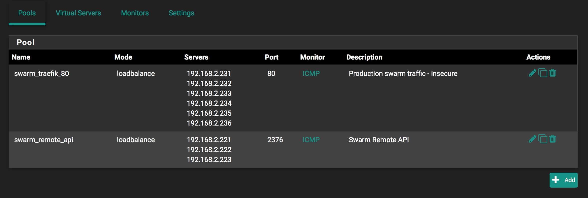

With the following sample values:

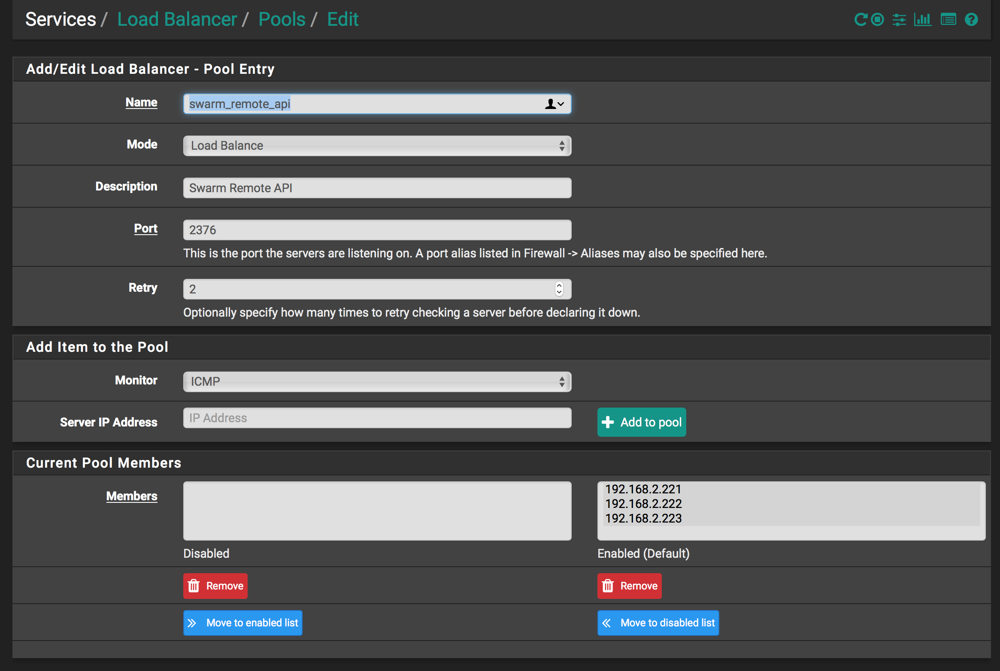

#### Setup pfSense Virtual Servers

And then the corresponding virtual servers:

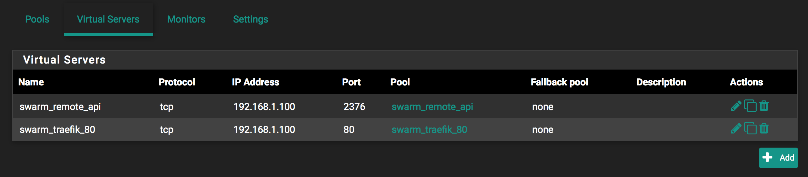

With the configuration as shown in this example:

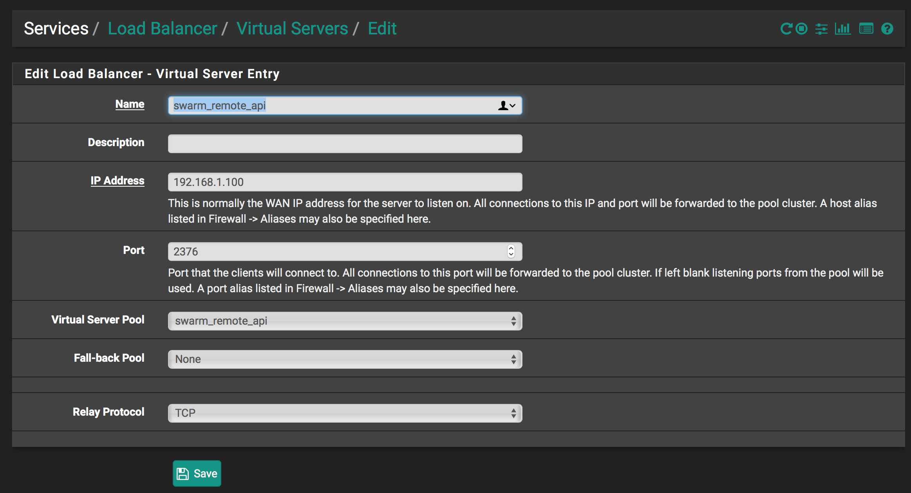

## Setup pfSense WAN Firewall Rules

In __Firewall > Rules > WAN__ add the following rules (as depicted):

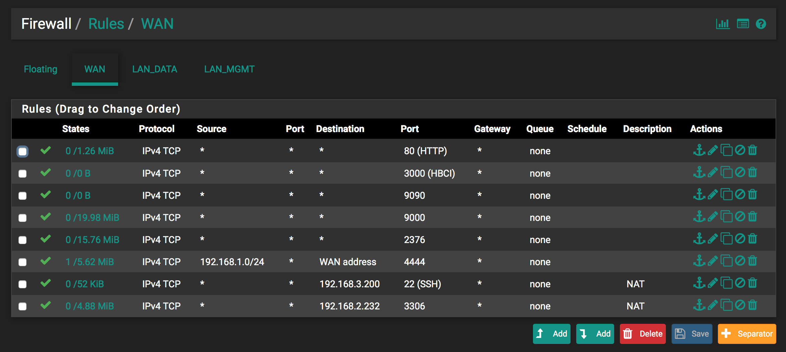

> __Note__ do not create the entries shown that are linked to incoming NAT port forwarding.  These are listed near the bottom and show __NAT__ in the description.  They will be created as part of the NAT inbound port forwarding.

## Setup HAProxy SSL Offloaded Services

__pfSense__ can run __HAProxy__ as an integrated package.

Install __HAProxy__ on your __cluster-gateway__ through __System > Package Manager__, and search for __haproxy__.

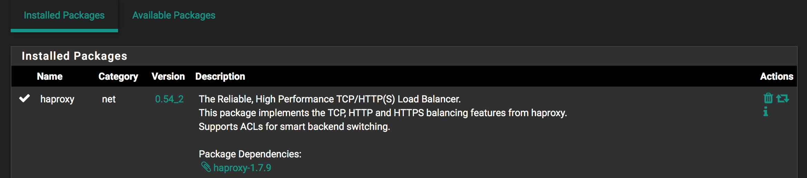

Once installed, it can be accessed through __Services > HAProxy__.

Prometheus, Grafana and Portainer are all secured and accessed through HAProxy.

### Install the self-signed (internal) certificate for management services

Upload the certificate that will be used for the offloading to pfSense __System > Certificate Manager__:

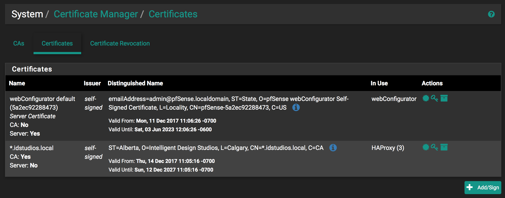

This will be used by HAProxy.

> If you need to create your own self signed certificate there are numerous step-by-step guides on the internet, just google __openssl create self-signed certificate__.

### Setup HAProxy Backends

Create the three required HAProxy Backend pools:

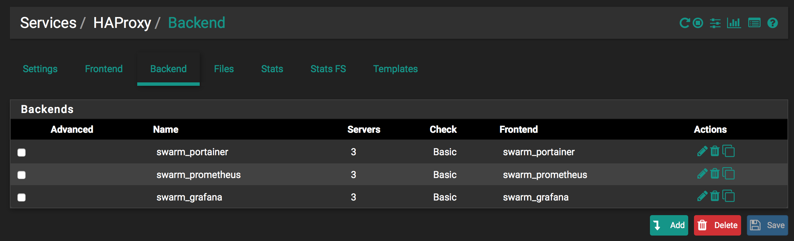

As per the example settings shown here for the general pool detail:

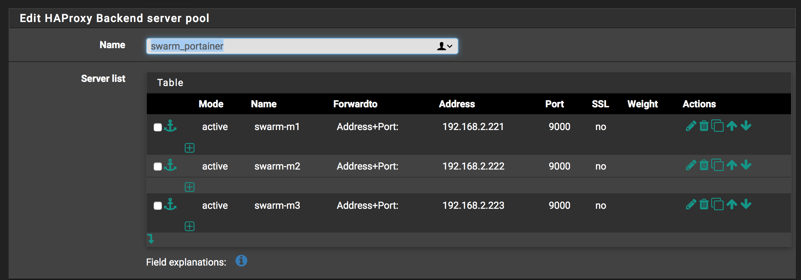

And ensure that the health check is set to basic:

### Setup HAProxy Frontends

Create the three required HAProxy Frontends:

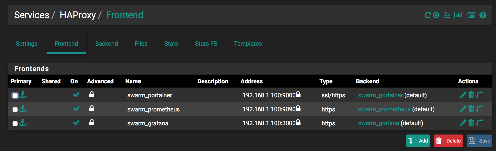

As per the example settings shown here for the general frontend detail:

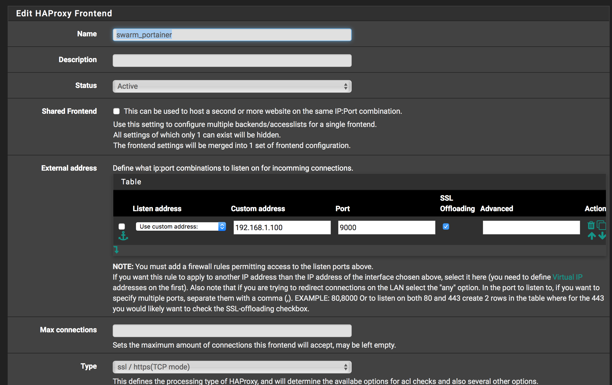

__Note__: Ensure to set the correct default backend:

And select the correct SSL certificate:

The __cluster-gateway__ HAProxy should now be correctly configured.

## Setup NFS Server VM

If NFS services are required for development or testing purposes it is relatively easy to setup an NFS server VM.

Using the CentOS7 template OVA (found in __node-packer/output_ovas__), create a new VM in ESX and call it __nfs-server__.

Make sure NFS is installed:

    yum install nfs-utils

Assign it an IP address on the Data plane network (192.168.2).

Create a local volume to share:

Eg.

    sudo mkdir -p /data/shared

Edit the __/etc/exports__ file.

    /data/shared *(rw,sync,no_root_squash)

And restart/enable the __nfsd__

    sudo systemctl restart nfs
    sudo systemctl enable nfs

The shares should then be available to mount.  Remember to configure the __nfs_shares.yml__ file accordingly in the cluster definition package prior to deployment.

## Deploy Cluster

Swarm cluster deployment must be done from the __control-station__ but is otherwise the same:

Eg.

    bash cluster-deploy ids/swarm-prod

> __Note__ use the cluster definition package created earlier.

> __Note__ that once the environment has been established and properly configured the swarm can be deployed and redeployed as normal.

## Troubleshooting

> TODO: common issues