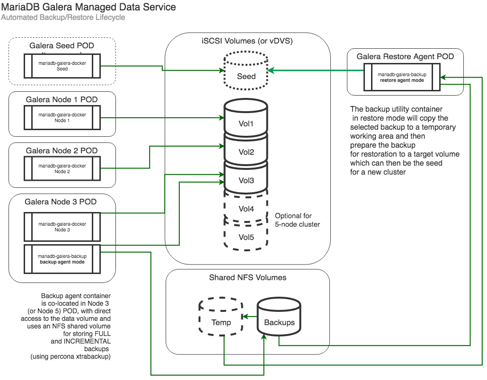
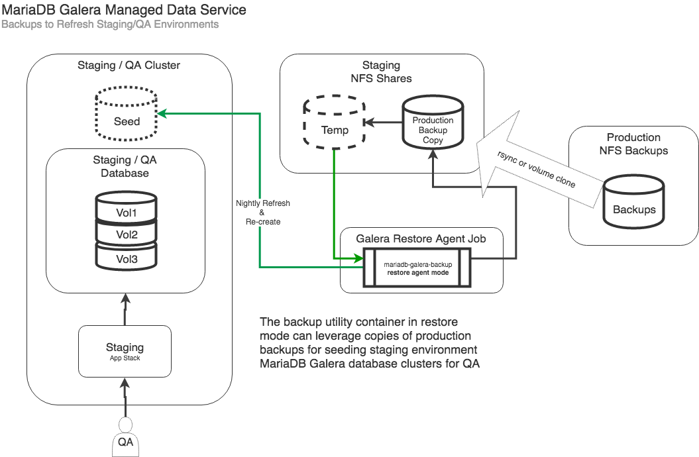
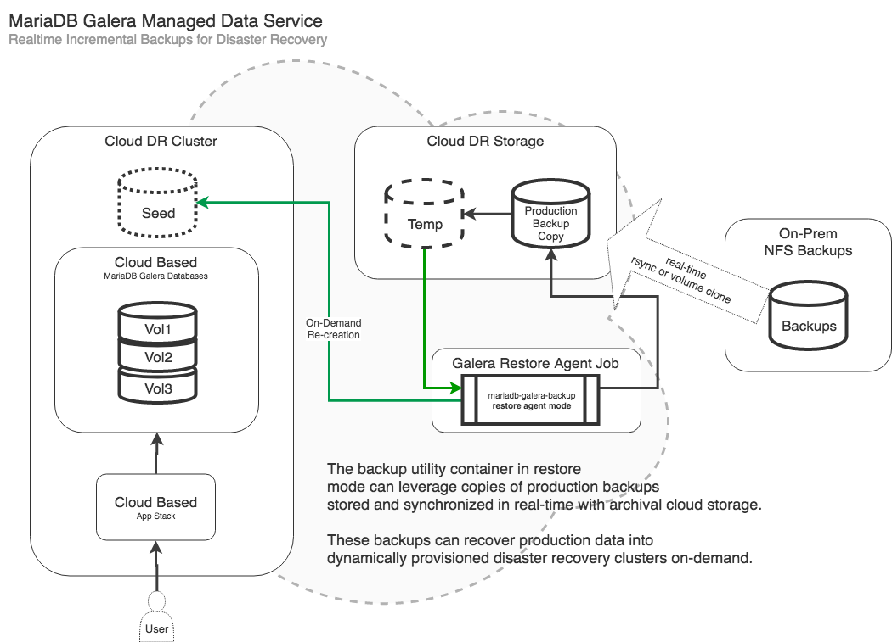

# Drupal/MariaDB Galera Load Test Stack

The Drupal/MariaDB Galera load test stack is a complete out-of-the-box deployment complete with a populated database sample set, sample image files (for the NFS share), and a pre-generated set of Taurus/Blazemeter load test scripts.

The following documentation is a guide through deploying this stack in two parts:

1. The MariaDB Galera database containers
2. The Drupal web containers.

## MariaDB Galera on Kubernetes

This implementation has been tested in two variants:

* Using iSCSI direct volumes and NFS shares in CoreOS Tectonic with Nodeport external access.
* Using vSphere storage volumes and NFS shares in VMware PKS with dedicated external LB access.

There is also the option to enable an automated backup agent as a sidecar container, which uses an NFS share to store the backups.

With the __backup agent__ enabled, it also requires an __NFS__ volume for the backup storage.

[AWS Storage Gateway](https://aws.amazon.com/storagegateway/) is a great way to deliver iSCSI and NFS storage into an ESXi environment with auto-replication to AWS storage services and management through the AWS console.  It's pretty awesome.

## Ansible Template Approach

It uses ansible templates to generate __MariaDB Galera__ yaml manifests based on configuration information supplied via an ansible inventory file.

The templates generate two sets of configuration files:

* 3-node
* 5-node

In the __clusters__ folder create a sub-folder and give it a name that matches what you would like as the distinguishing prefix for your cluster (Eg. tier1, core, pks).

Add or adjust the ansible configuration file with the specifics to your environment, see the __galera.conf__ examples in __clusters/eg/mariadb__ folder.  

Run the ansible playbook to generate the Kubernetes YAML deployment manifests:

    $ ansible-playbook -i <cluster package folder>/galera.conf ansible/mariadb-galera-template.yml

This will create a set of output manifest files in the `<cluster package folder>/galera/<stack name>` folder that can then be deployed to Kubernetes.  The configuration file will determine whether manifests are generated for either the 3 or 5 nodes.

There is also two variants of deployment:

* __Without__ Integrated Backup Agent
* __With__ Integrated NFS Backup Agent

## VMware PKS

For VMware PKS it is important to make sure you have defined the storage class as it uses the vSphere volume storage driver for docker for the persistent volumes.  The examples use the __vmware-thin__ storage class (available in the __etc__ folder), but this can be adjusted in the configuration file.

__Important__ that the VMware storage driver is __NOT__ marked as default as it doesn't handle NFS and iSCSI intrinsic volumes properly.  Run the following command to __unset__ the vSphere storage driver as the default:

        kubectl patch storageclass vmware-thin -p '{"metadata": {"annotations":{"storageclass.kubernetes.io/is-default-class":"false"}}}'

> This has been tested and developed on a __VMware Pivotal PKS__ cluster.  For details on configuring an NSX-T/PKS home lab [see this guide](https://github.com/ids/the-noobs-guide-to-nsxt-pks).

### VMware PKS Configuration File Example

The following is an example VMware PKS __galera.conf__ file:

    [all:vars]
    galera_cluster_name=pks
    galera_cluster_namespace=web
    galera_cluster_docker_image=idstudios/mariadb-galera:10.3
    galera_cluster_haproxy_docker_image=idstudios/mariadb-galera-haproxy:latest
    galera_cluster_backup_agent_image=idstudios/xtrabackup-agent:latest

    galera_target_datastore=san
    galera_vsphere_storage_class=vmware-thin

    galera_cluster_volume_size=10Gi
    galera_cluster_backup_volume_size=10Gi
    galera_cluster_backup_nfs_server=192.168.1.107
    galera_cluster_backup_path="/idstudios-files-galera-backups"
    galera_cluster_backup_retention_days=3
    galera_cluster_backup_incremental_interval="60m"

    galera_xtrabackup_password=Fender2000
    galera_mysql_user=drupal
    galera_mysql_password=Fender2000
    galera_mysql_root_password=Fender2000
    galera_mysql_database=drupaldb
    galera_cluster_backup_user=root

    [template_target]
    localhost

## CoreOS Tectonic

> Make sure to clear out the iSCSI volumes between cluster creations.  If there is existing galera data on the volumes the clusters will try to recover instead of forming new nodes. See [Purge Seed and Node Data Volumes](#purge-seed-and-node-data-volumes) on how to do this.

> This has been tested and developed on the __Tectonic CoreOS__ cluster from [cluster-builder](https://github.com/ids/cluster-builder).  It requires you have a working [kubectl configuration](https://coreos.com/tectonic/docs/latest/tutorials/aws/first-app.html#configuring-credentials) already in place.

This configuration uses iSCSI direct access for the persistent data volumes.  It requires access to an iSCSI target that contains at least 4 luns: 1 for the initial seed volume which will be discarded, and 3 or 5 nodes for the permanent node volumes.

> The most current configuration uses the __Targetd Storage Appliance__ and can be deployed with a minor change to the volumes yaml manifest.  To use this approach, ensure that you specify the `galera_iscsi_storage_class` in the `galera.conf` file, and it will generate a manifest to use dynamic iSCSI provisioning as `galera-3-volumes-targetd.yml`.

### CoreOS Configuration File Example for AWS Storage Gateway or Static iSCSI

> Note that in this configuration you must specify the iSCSI targets and LUNs explicitly.

    [all:vars]
    galera_cluster_name=tier1
    galera_cluster_namespace=web
    galera_cluster_docker_image=idstudios/mariadb-galera:10.3
    galera_cluster_haproxy_docker_image=idstudios/mariadb-galera-haproxy:latest
    galera_cluster_backup_agent_image=idstudios/mariadb-galera-backup:latest
    galera_cluster_nodeport=30306

    galera_cluster_seed_iscsi_targetportal="192.168.100.40:3260"
    galera_cluster_seed_iscsi_iqn="iqn.2018-04.io.idstudios:server.target0"
    galera_cluster_seed_iscsi_lun=1

    galera_cluster_volume_size=50Gi
    galera_cluster_backup_volume_size=50Gi
    galera_cluster_backup_log_volume_size=50Gi
    galera_cluster_backup_nfs_server=192.168.100.40
    galera_cluster_backup_path="/data/shared/backups"
    galera_cluster_backup_retention_days=7

    galera_cluster_node1_iscsi_targetportal="192.168.100.40:3260"
    galera_cluster_node1_iscsi_iqn="iqn.2018-04.io.idstudios:server.galera"
    galera_cluster_node1_iscsi_lun=1

    galera_cluster_node2_iscsi_targetportal="192.168.100.40:3260"
    galera_cluster_node2_iscsi_iqn="iqn.2018-04.io.idstudios:server.galera"
    galera_cluster_node2_iscsi_lun=2

    galera_cluster_node3_iscsi_targetportal="192.168.100.40:3260"
    galera_cluster_node3_iscsi_iqn="iqn.2018-04.io.idstudios:server.galera"
    galera_cluster_node3_iscsi_lun=3

    galera_xtrabackup_password=Fender2000
    galera_mysql_user=drupal
    galera_mysql_password=Fender2000
    galera_mysql_root_password=Fender2000
    galera_mysql_database=drupaldb

    galera_cluster_backup_user=root

    [template_target]
    localhost

### CoreOS Configuration File Example for Targetd and the iscsi-provisioner

> Note that in this configuration you only need to reference the storage class deployed as part of the __Targetd Storage Appliance__.

    [all:vars]
    galera_cluster_name=core
    galera_cluster_namespace=web
    galera_cluster_docker_image=idstudios/mariadb-galera:10.3
    galera_cluster_haproxy_docker_image=idstudios/mariadb-galera-haproxy:latest
    galera_cluster_backup_agent_image=idstudios/xtrabackup-agent:latest
    galera_cluster_nodeport=31306

    galera_iscsi_storage_class=iscsi-targetd-vg-targetd

    galera_cluster_volume_size=3Gi
    galera_cluster_backup_volume_size=3Gi
    galera_cluster_backup_nfs_server=192.168.1.107
    galera_cluster_backup_path="/idstudios-files-galera-backups"
    galera_cluster_backup_retention_days=3
    galera_cluster_backup_incremental_interval="60m"

    galera_xtrabackup_password=Fender2000
    galera_mysql_user=drupal
    galera_mysql_password=Fender2000
    galera_mysql_root_password=Fender2000
    galera_mysql_database=drupaldb
    galera_cluster_backup_user=root

    [template_target]
    localhost

### 3 or 5 Node Galera

#### Step 0 - Namespace

If the namespace is other then __default__ and does not already exist:

    kubectl apply -f namespace.yml

#### Step 1 - Setup Persistent Volumes

From within the 3-node galera cluster folder, apply the configurations in order:

##### PKS

    kubectl apply -f vsphere-volumes.yml

##### Static iSCSI

    kubectl apply -f static-volumes.yml

##### Dynamic iSCSI (Targetd)

    kubectl apply -f targetd-volumes.yml

This will setup the persistent volumes for the galera nodes.

#### Step 2 - Launch the Seed Instance

    kubectl apply -f seed.yml

This will bring up the seed instance of mysql... wait until it starts and is ready with mysql accepting connections before moving on to the nodes.

#### Step 3 - Launch the Permanent Galera Nodes

If you wish to deploy without a backup agent, use:

    kubectl apply -f nodes.yml

Or, with a backup agent:

    kubectl apply -f nodes-with-backup.yml

The nodes should come up fairly quickly.  Once they are all up and ready, start the HAProxy:

#### Step 4 - Start the Database HAProxy

This load balances all communication with the database equally over the nodes in the galera cluster:

    kubectl apply -f haproxy.yml

#### Step 5 - Decomission the Seed Node

Delete the seed node:

    kubectl delete -f seed.yml

Which should leave a __3__ or __5__ node cluster fronted by HAProxy.

`kubectl exec` into any of the nodes and verify the cluster:

    mysql -u mariadb-galera-haproxy -u root -p
    > show status like '%wsrep%';

It should show the 3 or 5 node cluster configuration information.

You can then enable and disable external access to the cluster (for data loading):

#### Enable/Disable External Access

##### PKS Load Balancer

    kubectl apply -f external-lb.yml

> This dedicates an NSX-T load balancer to galera and exposes 3306 on it.

    mysql -h <address of nsx-t lb> -u root -p

##### NodePort

    kubectl apply -f external-nodeport.yml

> This opens the specified __NodePort__ from the configuration and accepts connections.

    mysql -h <address of worker node> --port <node port specified> -u root -p

Will give you access to the running galera cluster through the HAProxy.

    kubectl delete -f external-nodeport.yml

Will close off external access.

## Automated Backup / Restore

The __Kubernetes__ verion of __mariadb-galera-docker__ enables the integration of an automated backup and restore agent.

Each Galera instance will bundle a __mariadb-galera-backup__ agent with the last node in the cluster.  It is co-located in the POD with the database engine, and performs periodic backups to a configured NFS share (made available as a persistent volume).

The backup agent will perform periodic compressed backups at a configured interval.  These backups can then be __restored__ into Staging / QA environments:

In support of the final stage of a QA process, or as part of a __Disaster Recovery__ strategy:

Leveraging real-time replicated __Cloud Storage__ backups and a __Hybrid Cloud__ infrastructure, production environments dependent on __mariadb-galera-docker__ can be recreated on demand with backups current to the __defined incremental interval__ before failure.

The __mariadb-galera-backup__ container, in __restore__ mode, will copy a target backup to a temporary working folder (so as to be non-destructive to the original backup), and then restore it to the latest incremental backup in the series.

> __Note__ that the current implementation always chooses the most recent backup.  Future iterations will include the ability to specify point in time incremental restore.

To perform a restore, ensure that the restore job manifest maps to the correct volumes:

    apiVersion: batch/v1
    kind: Job
    metadata:
    name: tier1-galera-restore-job
    spec:
    template:
        spec:
        volumes:
        - name: <cluster name>-galera-backup-volume
            persistentVolumeClaim:
            claimName: <cluster name>-galera-backup-volume-claim
        - name: <cluster name>-galera-backup-temp-volume
            persistentVolumeClaim:
            claimName: <cluster name>-galera-backup-temp-volume-claim
        - name: <cluster name>-galera-seed-volume
            persistentVolumeClaim:
            claimName: <cluster name>-galera-seed-volume-claim
        
        containers:
        - name: <cluster name>-galera-backup-agent
            image: idstudios/mariadb-galera-backup:latest
            args: ["restore"]
            env:
            - name: SOURCE_BACKUP
            value: "latest"
            - name: SOURCE_INCREMENT
            value: "latest"
            
            volumeMounts:
            - name: <cluster name>-galera-backup-volume
                mountPath: "/backups"
            - name: <cluster name>-galera-backup-temp-volume
                mountPath: "/temp"
            - name: <cluster name>-galera-seed-volume
                mountPath: "/target"
        restartPolicy: Never
    backoffLimit: 4

__(cluster name)-galera-backup-volume__ must point to the root NFS volume that contains the backups.

__(cluster name)-galera-backup-temp-volume__ must point to an NFS volume that contains enough space to hold the fully uncompressed backups.

__(cluster name)-galera-seed-volume__ should point to the target seed volume that will be the seed for the newly created galera cluster.

> The __idstudios/mariadb-galera-backup:latest__ is not tied to the original cluster for __restore__, and only requires a copy of the backups.  It can even be used against non-galera MariaDB and MySQL database backups.

#### Purge Seed and Node Data Volumes

The current implementation uses native Kubernetes iSCSI integration for the underlying data volumes, and NFS for the backup and scratch storage.

The iSCSI volumes are not easily accessed directly, so the template scripts produce a utility job for wiping these underlying iSCSI data volumes clean - which can be handy in development.

> Please use with caution

    kubectl apply -f galera-3-purge-volumes-job.yml

> This requires that the volumes have already been created with:

    kubectl apply -f galera-3-volumes.yml

## MariaDB Galera Helm Chart

https://docs.helm.sh/

Coming Soon.

# Drupal on Kubernetes

Drupal manifests for kubernetes deployment.

1. [Ansible Template Generated Manifests](#ansible-template-generated-manifests)
2. [Ansible Hosts File Configuration](#ansible-hosts-file-configuration)
3. [Sample Data](#sample-data)
4. [Blazemeter Load Testing](#blazemeter-load-testing)
5. [VMware PKS LoadBalancer](#vmware-pks-loadbalancer)
6. [Tectonic Ingress](#tectonic-ingress)
7. [Rolling Deployments](#rolling-deployments)

## Ansible Template Generated Manifests

Uses ansible templates to generate __Drupal__ yaml manifests based on configuration information supplied via an ansible inventory file.

In the __cluster package folder__ folder place a configuration file for the drupal stack (eg. drupal.conf).

Run the ansible playbook to generate the Kubernetes YAML deployment manifests:

    $ ansible-playbook -i deployments/my-deploy/drupal.conf drupal-template.yml

This will create a set of output manifest files in the __deployment package folder__ that can then be used for deployment to Kubernetes:

From within the __deployment package folder__ package folder apply the generated manifest:

    kubectl apply -f drupal.yml

> You can then access the drupal site via the __NodePort__ specified, using the load balanced ingress address to the k8s cluster (or any worker node): Eg. http://core-ingress.idstudios.io:30200

Front end proxying and ingress via Traefik, Nginx or Tectonic Ingress is left as an excercise for the user.

## Ansible Hosts File Configuration

Fairly self explanatory, adjust to your environment:

### CoreOS Example

    [all:vars]
    drupal_stack_name=drupal7
    drupal_stack_namespace=web
    drupal_docker_image=idstudios/drupal:plain
    drupal_nodeport=30200

    drupal_domain=drupal-internal.idstudios.io

    drupal_files_nfs_server=192.168.1.107
    drupal_files_nfs_path="/idstudios-files-drupal-test"
    drupal_files_volume_size=10Gi

    drupal_db_host=staging-galera-haproxy
    drupal_db_name=drupaldb 
    drupal_db_user=root 
    drupal_db_password=Fender2000

    [template_target]
    localhost

### VMware PKS Example

    [all:vars]
    drupal_stack_name=drupal7
    drupal_stack_namespace=web
    drupal_docker_image=idstudios/drupal:plain

    drupal_domain=drupal-nsx.onprem.idstudios.io
    drupal_service_port=8000

    drupal_files_nfs_server=192.168.1.107
    drupal_files_nfs_path="/idstudios-files-drupal-test"
    drupal_files_volume_size=10Gi

    drupal_db_host=pks-galera-haproxy
    drupal_db_name=drupaldb 
    drupal_db_user=root 
    drupal_db_password=Fender2000

    [template_target]
    localhost

This values supplied in this file will generate the resulting manifest using the ansible j2 template.

__Note__ that __drupal_domain__ is the site domain name used for host header routing via the ingress proxy.

> The __template_target__ inventory group should always contain __localhost__ as the location of the template generation takes place locally.  A future __Helm__ chart will deprecate the use of ansible.

## Sample Data

> Note that with the new image `drupal_docker_image=idstudios/drupal:plain` you do not need to perform the manual data loads, or unpack the sample image files to the NFS share, the image will take care of this automatically at startup.  Replicas has been set to 1 so that the intialization does not enter race, make sure to scale up for load tests: `kubectl scale --replicas=5 deploy/core-drupal`.

In the __data__ folder there is a __drupadb_sample.sql__ file that will load a sample drupal data set into a __drupaldb__ database.  This can be done by connecting to the NodePort (CoreOS) or Load Balancer (PKS) that exposes the MariaDB:

    mysql -h <ingress url> --port <node port> -u <mysql user> -p < drupaldb_sample.sql

Eg.

    mysql -h core-ingress.idstudios.io --port 31306 -u root -p < drupaldb_sample.sql

The sample Drupal7 database data is paired with some sample image uploads, that are expected to reside on the shared NFS volume that holds the file uploads (shared among all of the front end instances of Drupal).  These sample files are located in the __data__ directory, as __drupal_files.tar.gz__.

Expand the __drupal_files.tar.gz__ on the host mounted NFS share and then ensure that the deployment configuration references that folder as the shared host mounted NFS share:

In the deployment configuration file, the settings for the NFS mapping are as follows:

    drupal_files_nfs_server=<nfs server>
    drupal_files_nfs_path="/<nfs path to drupal files folder>"
    drupal_files_volume_size=<size of volume allocation> (eg. 10Gi)

> Unfortunately this requires the manual step of pre-configuring the sample files on the target NFS share before drupal stack deployment.

## VMware PKS LoadBalancer

A sample __VMware PKS__ _LoadBalancer_ manifest is created that will create a dedicated load balancer exposing __drupal_service_port__ (SSL termination coming soon).

    kubectl apply -f drupal-pks-lb.yml

And then check for the assigned IP address:

    kubectl get svc

You should see the assigned Drupal LB hosted on the designated __drupal_service_port__.

## Tectonic Ingress

A sample __Tectonic Ingress__ manifest is created that will do host header routing for the __drupal_domain__ over port 80 (SSL termination coming soon).

    kubectl apply -f drupal-tectonic-ingress.yml

## Blazemeter Load Testing

Example [Blazemeter](https://www.blazemeter.com/) scripts are created based on the configured __drupal_domain__ and sample data URLs to exert __moderate__ and __heavy__ load on the __drupal stack__.

    bzt loadtests/med_load.yml

or

    bzt loadtests/heavy_load.yml

> These can be adjusted and extended as needed and serve as examples.

## Rolling Deployments

Simply updating the image to the __themed__ variant is a good way to test rolling deployments.  Manually edit the generated __drupal.yml__ file and change the __image/tag__:

Eg.

        containers:
            - name: test-drupal
              image: idstudios/drupal:themed

And then simply apply the changes:

    kubectl apply -f drupal.yml

> You can use the __idstudios/drupal:themed__ variant to test a deployment.

The deployment will begin a rolling update, as this is what __Deployments__ do by default in Kubernetes.

> Combining the __Blazemeter__ load testing with a __rolling deployment__ really demonstrates what makes Kubernetes so amazing!